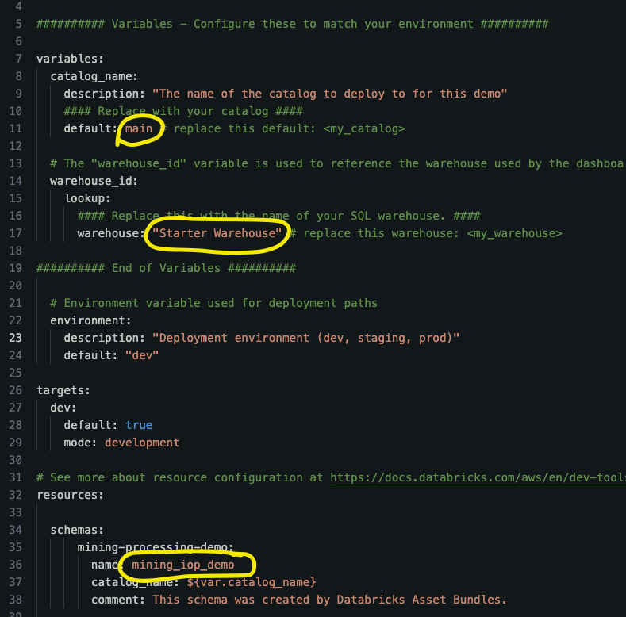
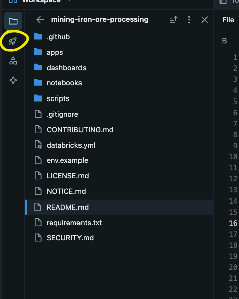
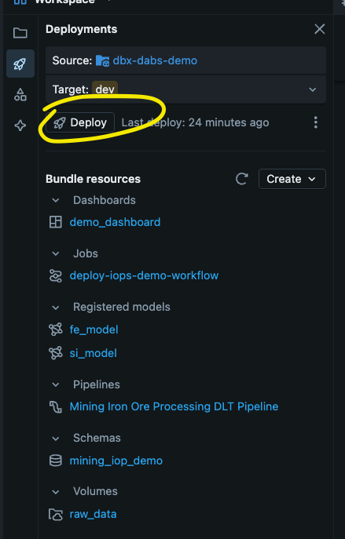
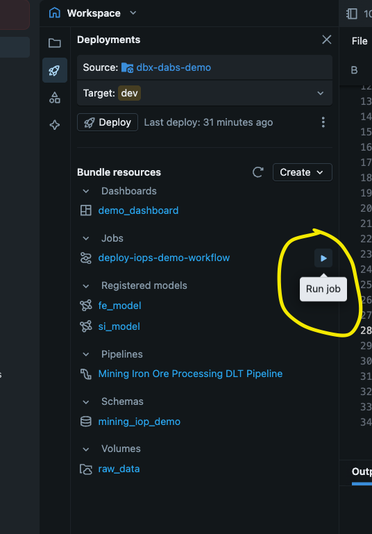

# 🏭 Fe Concentrator Demo

<div align="center">
  <h2>End-to-End AI & Optimization Solution for Iron Ore Processing</h2>
  <p>Deployed using <strong>Databricks Asset Bundles (DABs)</strong></p>
</div>

---

## 🚀 Quick Start

### 📋 Prerequisites
- Access to a Databricks workspace
- Catalog and SQL Warehouse permissions
  - USE CATALOG, CREATE SCHEMA, 
- Git repository access
- Enable the following preview features in your workspace:
  - **Data Classification**
  - **Databricks Apps - On Behalf of Authentication**

---

## ⚙️ Workspace Setup

### 1️⃣ **Clone Repository to Workspace**
   - Navigate to **Workspace → Create → Git Folder**
   - Paste the repository HTTPS URL
   - Click **"Create"**

### 2️⃣ **Deploy via DABs in the UI**

#### 🔧 **Edit DABs Configuration**
Open the `databricks.yml` file from the root of the git repo and configure your `Catalog` name and desired `Warehouse` name:

<div align="center">
   
   <br/><em>Configure your catalog and warehouse settings</em>
</div>

#### 🚀 **Access DABs UI**
Select the DABs icon (rocket ship) in the side menu:

<div align="center">
   
   <br/><em>Locate the DABs rocket ship icon</em>
</div>

#### 📦 **Deploy Resources**
Click the **"Deploy"** button in the DABs UI:

<div align="center">
   
   <br/><em>Deploy your bundle resources</em>
</div>

#### ▶️ **Run Setup Workflow**
Once artifacts are deployed, run the workflow to set up models and optimizations:

<div align="center">
   
   <br/><em>Execute the deployment workflow</em>
</div>

### 3️⃣ **Deploy via DABs using CLI**

#### 📥 **Install Databricks CLI**
First, install the Databricks CLI on your local machine:

```bash
# Using pip
pip install databricks-cli

# Or using Homebrew (macOS)
brew install databricks-cli

# Or download from releases
# https://github.com/databricks/cli/releases
```

#### 🔐 **Authenticate to Workspace**
Configure authentication to your Databricks workspace:

```bash
# Configure authentication (you'll be prompted for host and token)
databricks auth login

# Or set up with specific host
databricks auth login --host https://your-workspace.cloud.databricks.com
```

You'll need:
- **Workspace URL**: Your Databricks workspace URL
- **Personal Access Token**: Generate from User Settings → Developer → Access Tokens

#### 🔧 **Configure DABs Settings**
Edit the `databricks.yml` file to configure your `catalog_name` and `warehouse_id` settings as shown in the UI section above.

#### 🚀 **Deploy the Bundle**
Navigate to the project directory and deploy:

```bash
# Deploy the bundle (creates all resources)
databricks bundle deploy

# Run the demo workflow specifically
databricks bundle run demo_workflow
```

> **💡 Tip**: The `demo_workflow` job includes all setup tasks including model training and optimization. This is equivalent to running the workflow via the UI.

---

## 📦 What Gets Deployed

<table align="center">
<tr>
<td width="50%">

### 🔄 **Core Components**
- **🔧 Workflow**: `deploy-iops-demo-workflow`
- **📊 Dashboard**: `demo_dashboard` 
- **🌐 App**: `demo-app` (Streamlit)
- **⚡ Pipeline**: `Mining Iron Ore Processing DLT Pipeline`

</td>
<td width="50%">

### 🤖 **ML Components**
- **🎯 Models**: `fe_model` & `si_model`
- **🚀 Serving Endpoints**: Real-time model serving
- **🔄 Deployment Jobs**: CI/CD with approval gates
- **📈 Monitoring**: Model performance tracking

</td>
</tr>
</table>

---

## 📁 Project Structure

```
mining-iron-ore-processing/
├── 📄 databricks.yml                    # Main DABs configuration
├── 📚 notebooks/
│   ├── 🎯 mining_iron_ore_processing/   # 🌟 Main Demo Entry Point
│   ├── 🛠️  demo_setup/                   # Helper functions & resources
│   └── 📤 outputs/                      # Model artifacts & outputs
├── 📊 dashboards/
│   └── Fe Concentrator Prediction Dashboard.lvdash.json
├── 🖥️  apps/
    └── src/
        ├── app.py                       # Streamlit application
        └── app.yaml                     # App configuration

```

---

## ⏱️ **Important Note**

<div align="center">
  <div style="background-color:rgb(101, 82, 22); border: 1px solid #ffeaa7; border-radius: 8px; padding: 20px; margin: 20px 0;">
    <h3>⚠️ Deployment Time</h3>
    <p><strong>Expected Duration:</strong> ~20-25 minutes</p>
    <p>This includes model training and optimization runs. Please be patient and confirm the workflow completes before starting the demo!</p>
  </div>
</div>

---

## 🎯 **Getting Started with the Demo**

<div align="center">
  <div style="background-color:rgb(39, 72, 46); border: 1px solid #c3e6cb; border-radius: 8px; padding: 20px; margin: 20px 0;">
    <h3>📍 Demo Entry Point</h3>
    <p>Navigate to: <code>notebooks/mining_iron_ore_processing_demo/</code></p>
    <p>Start with: <strong>00. Introduction and Configuration</strong></p>
    <p>💡 <em>Always run "Run All" in each notebook for the complete experience!</em></p>
  </div>
</div>

---

<div align="center">
  <h2>🚀 That's it! Enjoy the Demo! 🚀</h2>
  <p><em>Happy Mining & Optimizing! ⛏️✨</em></p>
  <p><em>✨✨ With love from the West Aussie crew. #WestIsBest ✨✨</em></p>
</div>
